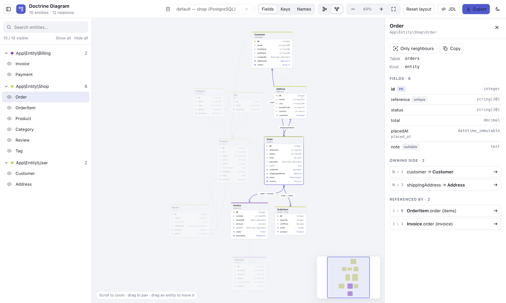

<h1 align="center">DiagramBundle — interactive Doctrine ERD / database diagram for Symfony</h1>

<p align="center">
  Visualise every <strong>Doctrine entity, field and relation</strong> of your Symfony application as an
  interactive <strong>entity-relationship diagram (ERD)</strong>: one selector per database / entity manager,
  crow's foot relations, search, JDL editor, SVG / PNG export. A JSON API plus a React studio that plugs
  into Twig, plain JavaScript, React and Vue — without connecting to your databases.
</p>

<p align="center">
  <a href="https://packagist.org/packages/benmacha/diagram-bundle"></a>
  <a href="https://packagist.org/packages/benmacha/diagram-bundle"></a>
  <a href="https://github.com/BenMacha/diagram-bundle/actions/workflows/ci.yml"></a>
  = 7.2.5">
  
  
  <a href="LICENSE"></a>
</p>



## Table of contents

- [Why DiagramBundle](#why-diagrambundle)
- [Requirements](#requirements) · [Installation](#installation) · [Routes](#routes) · [Configuration](#configuration)
- [Embedding](#embedding) — Twig, plain JavaScript (Web Component), React, Vue
- [Theming](#theming) · [Studio features](#studio-features) · [Security](#security) · [FAQ](#faq)

## Why DiagramBundle

- **Always up to date** — the diagram is generated from your Doctrine mapping (attributes, annotations, XML or YAML), not drawn by hand.
- **Every database** — multi entity managers (MySQL, PostgreSQL, SQL Server, SQLite, Oracle…) in one selector, with database name and driver.
- **No database connection needed** — mappings can be read straight from the mapping driver: works on CI, on read replicas, on databases you cannot reach.
- **Pluggable** — embed the ERD in your admin with one tag (`<doctrine-diagram>`), a React or a Vue component, or a Twig function.
- **Shareable** — export SVG, PNG, JSON or JDL (JHipster Domain Language), import and edit JDL with a live preview.

## Requirements

| Package        | Version                      |
|----------------|------------------------------|
| PHP            | `>= 7.2.5`                   |
| Symfony        | `5.4`, `6.4`, `7.x`          |
| Doctrine ORM   | `2.7+`, `3.x`                |
| Browser (studio) | evergreen browsers (Chrome, Firefox, Safari, Edge) |

## Installation

```bash
composer require benmacha/diagram-bundle
```

Register the bundle if Flex did not (`config/bundles.php`):

```php
Benmacha\DiagramBundle\DiagramBundle::class => ['all' => true],
```

Import the routes with the prefix of your choice (`config/routes/diagram.yaml`):

```yaml
diagram:
    resource: '@DiagramBundle/Resources/config/routes.yaml'
    prefix: /diagram
```

Publish the assets:

```bash
php bin/console assets:install public
```

Open **`/diagram/`**.

> ⚠️ The page and the API expose your whole database schema. Protect them — see [Security](#security).

## Routes

| Method | Path (prefix `/diagram`) | Description |
|--------|---------------------------|-------------|
| GET | `/diagram/` | Full page studio (Twig) |
| GET | `/diagram/api/managers` | Entity managers and the database each one is connected to |
| GET | `/diagram/api/schema?em=<name>` | Entities, fields and relations of an entity manager (JSON) |

### `GET /api/managers`

```json
{
  "default": "default",
  "managers": [
    { "name": "default", "connection": "default", "database": "app", "driver": "MySQL", "default": true },
    { "name": "legacy",  "connection": "legacy",  "database": "erp", "driver": "SQL Server", "default": false }
  ]
}
```

Database names and drivers are read from the connection parameters: **no connection is opened**
and no host / user / password is ever exposed.

### `GET /api/schema?em=default`

```json
{
  "manager": "default",
  "managers": [ … ],
  "source": "factory",
  "title": "Doctrine Diagram",
  "entities": [
    {
      "id": "App\\Entity\\Book",
      "name": "Book",
      "namespace": "App\\Entity",
      "table": "book",
      "kind": "entity",
      "parent": null,
      "fields": [
        { "name": "id", "column": "id", "type": "integer", "nullable": false, "unique": false, "id": true, "length": null },
        { "name": "title", "column": "title", "type": "string", "nullable": false, "unique": false, "id": false, "length": 255 }
      ]
    }
  ],
  "relations": [
    {
      "id": "App\\Entity\\Book::author",
      "type": "ManyToOne",
      "source": "App\\Entity\\Book",
      "target": "App\\Entity\\Author",
      "field": "author",
      "inverseField": "books",
      "joinColumns": ["author_id"],
      "joinTable": null,
      "nullable": true
    }
  ]
}
```

- `kind`: `entity`, `mapped_superclass`, `embeddable`.
- Only the **owning side** of a relation is listed (with `inverseField` when bidirectional), so each relation appears once.
- `source` tells how the mapping was read (see `metadata` below).

## Configuration

```yaml
# config/packages/diagram.yaml
diagram:
    # Entity managers exposed (empty = all Doctrine ORM entity managers)
    entity_managers: []
    # Entity class prefixes to hide
    exclude: ['DH\Auditor\']
    # How mappings are read:
    #   auto    (default) factory when it will not open a connection, driver otherwise
    #   factory Doctrine ClassMetadataFactory — exact, but needs the database platform:
    #           without `server_version`, Doctrine connects to the database
    #   driver  mapping driver only (attributes / annotations / XML / YAML) — never connects
    metadata: auto
    # Role required by the page and the API (needs symfony/security-bundle)
    access_role: ~
    title: 'Doctrine Diagram'
```

**Tip:** set `server_version` on your DBAL connections — the exact `factory` mode is then used
without ever touching the database. Both modes produce the same JSON (fields of mapped
superclasses and embeddables are merged in `driver` mode).

## Embedding

### Twig

```twig
{{ diagram_widget({ height: '720px', theme: 'auto', locale: 'fr', manager: 'default' }) }}
```

Options: `height`, `theme` (`light` | `dark` | `auto`), `locale` (`en` | `fr`), `manager`, `heading`.
`diagram_api_url()` returns the API base URL.

### Plain JavaScript (Web Component)

```html
<script src="/bundles/diagram/build/diagram.js" defer></script>

<doctrine-diagram api="/diagram" theme="auto" locale="fr" style="height: 80vh"></doctrine-diagram>

<script>
  const el = document.querySelector('doctrine-diagram');
  // Any option that is not a string: headers, fetch, schema…
  el.options = { headers: () => ({ Authorization: 'Bearer ' + localStorage.getItem('token') }) };
  el.addEventListener('entity-select', (e) => console.log(e.detail));
</script>
```

Attributes: `api`, `manager`, `theme`, `locale`, `heading`, `storage-key` (`false` disables
localStorage). Events: `entity-select`, `manager-change`. The element renders in a Shadow DOM:
the page CSS cannot break it.

Or mount it anywhere:

```js
const diagram = DoctrineDiagram.mount(document.getElementById('erd'), { apiUrl: '/diagram' });
diagram.update({ theme: 'dark' });
diagram.unmount();
```

ES module build: `/bundles/diagram/build/element.mjs` (React included, nothing else to load).

### React

The npm package is the bundle repository itself (`package.json` at its root). From a
Symfony app, point your front-end to the installed bundle:

```bash
npm install ../vendor/benmacha/diagram-bundle   # or: "file:../path/to/diagram-bundle"
```

```tsx
import { DiagramStudio } from '@benmacha/doctrine-diagram';

export function SchemaPage() {
  return (
    <div style={{ height: 'calc(100vh - 64px)' }}>
      <DiagramStudio
        apiUrl="https://api.example.com/diagram"
        headers={() => ({ Authorization: `Bearer ${getToken()}` })}
        theme="auto"
        locale="fr"
        onEntitySelect={(entity) => console.log(entity)}
      />
    </div>
  );
}
```

Add it to your router like any page (`<Route path="/schema" element={<SchemaPage />} />`).
`react` and `react-dom` (≥ 18) are peer dependencies; styles are injected automatically
(`injectStyles={false}` + `import '@benmacha/doctrine-diagram/style.css'` to manage them yourself).

### Vue 3

```vue
<script setup>
import { DoctrineDiagram } from '@benmacha/doctrine-diagram/vue';
const headers = () => ({ Authorization: `Bearer ${localStorage.getItem('token')}` });
</script>

<template>
  <DoctrineDiagram api-url="/diagram" :headers="headers" theme="auto" locale="fr" height="80vh"
                   @entity-select="(e) => console.log(e)" />
</template>
```

React is bundled inside the Vue build: nothing else to install. You can also use the
`<doctrine-diagram>` element directly (`app.config.compilerOptions.isCustomElement = (tag) => tag === 'doctrine-diagram'`).

### Static schema (no API)

Every flavour accepts a `schema` option (the JSON described above): handy for documentation
sites or to render a schema exported with the studio.

### Options (React / Vue / `mount()` / `element.options`)

| Option | Type | Description |
|--------|------|-------------|
| `apiUrl` | `string` | Base URL of the routes (`/diagram`) |
| `manager` | `string` | Entity manager shown first |
| `schema` | `Schema` | Static data, skips the API |
| `headers` | `object \| () => object \| Promise<object>` | Extra headers (authentication) |
| `credentials` | `RequestCredentials` | fetch credentials (default `same-origin`) |
| `fetch` | `typeof fetch` | Custom fetch (interceptors…) |
| `theme` | `light \| dark \| auto` | Default `auto` |
| `locale` | `en \| fr` | Default: browser language |
| `title` | `string` | Toolbar title |
| `height` | `string \| number` | Default `100%` |
| `storageKey` | `string \| false` | localStorage prefix for layout / hidden entities |
| `injectStyles` | `boolean` | Default `true` |
| `onEntitySelect` | `(entity \| null) => void` | |
| `onManagerChange` | `(name) => void` | |

## Theming

Colours are CSS custom properties; set them on any ancestor (they also cross the Shadow DOM):

```css
doctrine-diagram, .my-admin {
  --bmd-accent: #e11d48;
  --bmd-font: 'Inter', sans-serif;
}

/* follow a shadcn/ui (Tailwind) theme, light and dark */
.my-admin {
  --bmd-bg: hsl(var(--background));
  --bmd-surface: hsl(var(--card));
  --bmd-surface-2: hsl(var(--muted));
  --bmd-border: hsl(var(--border));
  --bmd-text: hsl(var(--foreground));
  --bmd-muted: hsl(var(--muted-foreground));
  --bmd-accent: hsl(var(--primary));
  --bmd-accent-foreground: hsl(var(--primary-foreground));
}
```

Tokens: `--bmd-accent`, `--bmd-accent-foreground`, `--bmd-bg`, `--bmd-surface`, `--bmd-surface-2`,
`--bmd-border`, `--bmd-text`, `--bmd-muted`, `--bmd-canvas`, `--bmd-grid`, `--bmd-edge`,
`--bmd-danger`, `--bmd-radius`, `--bmd-font`, `--bmd-font-mono`.

## Studio features

- One selector for every entity manager, labelled with its database and driver.
- Automatic layout (dagre), horizontal or vertical; drag entities to rearrange (remembered).
- Detail levels: all fields, keys only, names only (large schemas start with keys).
- Crow's foot relations anchored on the foreign key rows, inheritance arrows.
- Search, show / hide entities and whole namespaces, "neighbours only" focus.
- Inspector: table, columns, types, nullability, relations (click to navigate).
- JDL editor: edit / import `.jdl` / `.jh` files, the diagram updates live.
- Export SVG, PNG, JSON, JDL. Mini-map, keyboard shortcuts (`/` search, `f` fit, `+` / `-`, `Esc`).

## Security

The schema is sensitive. Either:

```yaml
# config/packages/diagram.yaml
diagram:
    access_role: ROLE_ADMIN
```

and/or restrict the path in `security.yaml`:

```yaml
security:
    access_control:
        - { path: ^/diagram, roles: ROLE_ADMIN }
```

With a stateless API (JWT…) put the routes behind the firewall that authenticates your API
calls and pass the token with the `headers` option. You can also import the routes only in
`dev` (`when@dev:` in `config/routes/diagram.yaml`).

## FAQ

**How do I generate an ERD / entity diagram from Doctrine entities in Symfony?**
Install the bundle, import its routes and open `/diagram/`: the diagram is built from the Doctrine metadata of each entity manager.

**Does it need a database connection?**
No in `driver` mode (and in `auto` mode when the connection has a `server_version`): the mapping files / attributes are read directly.

**Can I embed the diagram in a React, Vue or Angular admin?**
Yes: React component, Vue 3 component, or the framework-agnostic `<doctrine-diagram>` Web Component.

**Does it support several databases / entity managers?**
Yes, every Doctrine ORM entity manager appears in the selector (`entity_managers` to restrict the list).

**Can I export the schema?**
SVG and PNG images, JSON schema and JDL (JHipster Domain Language) files.

## Development

```bash
npm install
npm run build       # → src/Resources/public/build (committed: the bundle works without Node)
npm run typecheck
```

Sources: `assets/src` (TypeScript + React). PHP: `src/`.

## Upgrading from 1.x

- The API is JSON (`/api/schema`, `/api/managers`); the JDL text route `/sample.jdl` is gone —
  JDL import / export now lives in the studio.
- The AngularJS / CodeMirror / nomnoml front-end is replaced by the React studio.
- Routes: `@DiagramBundle/Resources/config/routes.yaml` (the 1.x `routing/routes.yml` still works).
- Symfony 5.4+ and PHP 7.2.5+ are required.

## License

MIT © [Ali Ben Macha](https://benmacha.tn)
